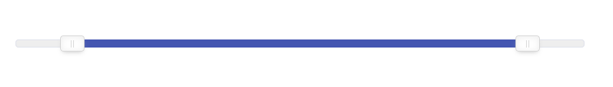

# Air Slider



## How to use

Add an input field to your HTML code

```
    <input type="text" id="simple-slider"/>
```

Add a small Javascript piece to your JS file:

```
    const simpleSlider = new AS({
        target: '#simple-slider',
        values: {min: 1, max: 100},
        step: 10,
        start: [10, 90],
    });
```

## Configuration

| Keys | Description |
| ----------- | ----------- |
| values | Object e.g. {min: 1, max: 10}|
| target   | Single element's class/id or HTML object e.g. document.querySelector('#simple-slider') |
| step | Slider step (default 1)|
| disabled | Boolean (true or false) to disable/enable slider (default false) |
| keyStep | It sets the step of the keyboard keys. Always multiplied by the STEP. (default 1)
| start | A flat array of two values to set initial values (optional) |

## Methods

Methods can be used after a new instance of slider is initiated e.g. slider.getValue();

| Method | Description |
| ----------- | ----------- |
| getValue() | Returns selected values |
| disabled(true/false) | Makes a slider disabled/enabledMakes a slider disabled/enabled |
| onChange(callback) | the callback function argument returns current selected values e.g ```simpleSlider.onChange((values) => { // argument values represents current values });```|
| destroy() | Removes an instance of slider e.g. ```mySlider.destroy();``` |
